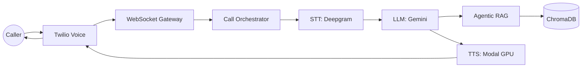
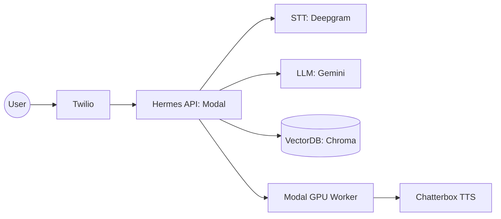

# Hermes AI

Hermes AI is a high-performance, low-latency voice AI orchestration platform designed for real-time telephony. It transforms raw audio streams into natural, context-aware voice conversations using an advanced Ear-Brain-Mouth pipeline.

## 🏛️ High-Level Architecture



## 🚀 Core Features

*   **Zero-Latency Greetings:** Immediate AI response upon connection, bypassing LLM "thinking" time.
*   **Agentic RAG:** Intelligent information retrieval with ChromaDB and filler speech to mask processing latency.
*   **Barge-In Support:** Seamless conversation flow with real-time speech detection and audio interruption.
*   **Modal Infrastructure:** Serverless GPU workers for high-speed speech synthesis (TTS) and scalable API hosting.
*   **Production Observability:** Unified structured JSON logging and real-time "Time to First Byte" (TTFB) telemetry.

## 🛠️ Infrastructure Deployment



## 📁 Project Structure

```text
├── hermes/               # Core application logic
│   ├── core/             # Orchestrator and Call state machines
│   ├── services/         # STT, LLM, TTS, and RAG implementations
│   ├── api/              # REST endpoints (Health, Ready, Twilio)
│   └── websocket/        # Real-time media stream handling
├── modal_deploy/         # Infrastructure-as-Code for Modal
├── scripts/              # Diagnostic and seeding tools
└── docs/                 # Detailed technical documentation
```

## 🚦 Quick Start

Detailed instructions for setup and deployment can be found in the `docs/` directory:

1.  **[Architecture Guide](docs/ARCHITECTURE.md):** Deep dive into the engine.
2.  **[Deployment Guide](docs/DEPLOYMENT.md):** Infrastructure setup.
3.  **[Development Guide](docs/DEVELOPMENT.md):** Local tools & telemetry.
4.  **[Troubleshooting](docs/DEBUGGING.md):** Production fixes.

---
**Status:** Production-Ready | Logic-Verified
