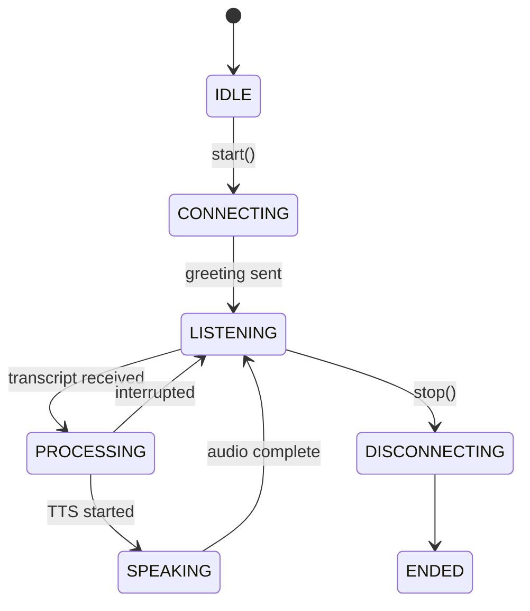
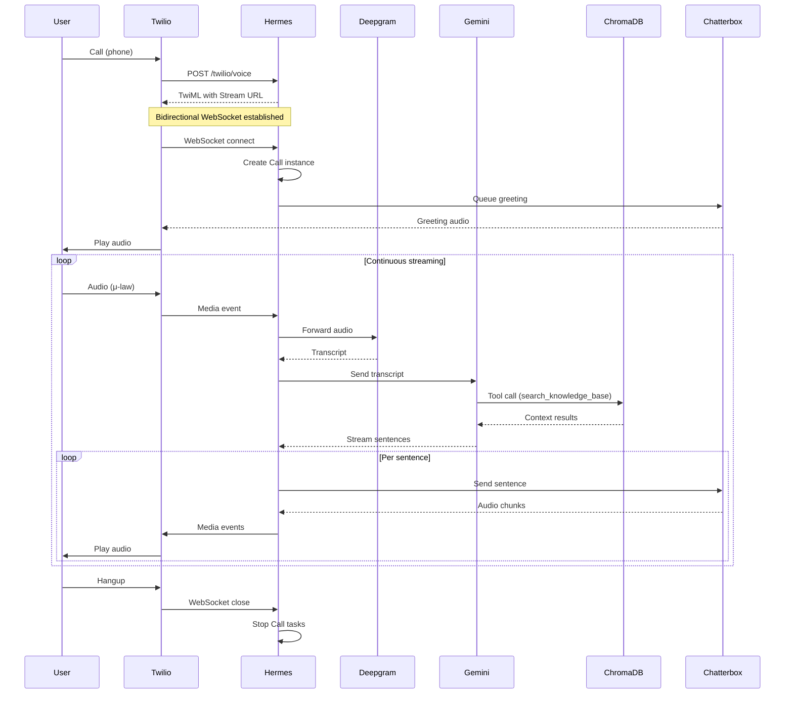
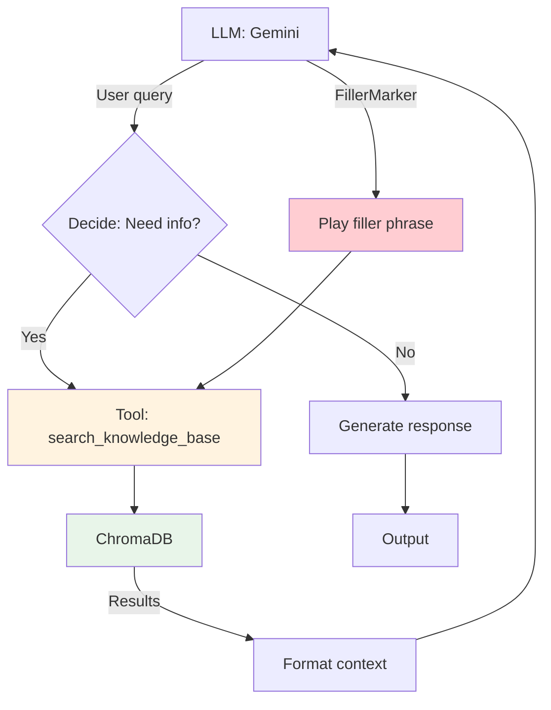
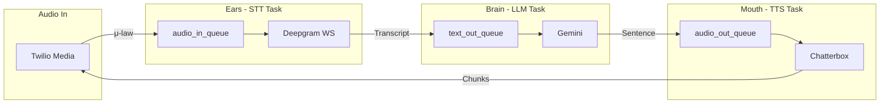
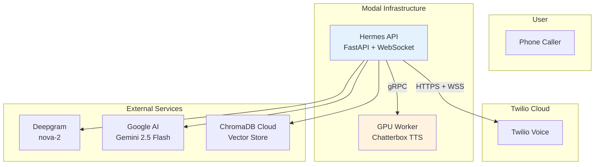

# Hermes AI

Hermes is a real-time AI voice support system that integrates telephony, streaming speech recognition, LLM reasoning, and text-to-speech synthesis to enable natural voice conversations at scale.

## Overview

Hermes bridges callers and AI through a low-latency pipeline:

```
Caller → Twilio → Hermes → STT → LLM + RAG → TTS → Caller
```

The system achieves real-time conversation by processing audio streams in parallel through three dedicated tasks:

- **Ears (STT):** Stream audio to Deepgram for real-time transcription
- **Brain ( Process transcriptsLLM):** with Gemini, retrieve context via RAG
- **Mouth (TTS):** Synthesize responses with Chatterbox and stream audio back

## Goals

- **Real-time conversation:** Sub-second response latency between user speech and AI reply
- **Natural voice interaction:** Full duplex communication with barge-in (interruption) support
- **Scalable voice support:** Serverless GPU infrastructure on Modal for elastic capacity
- **Agentic retrieval system:** LLM-driven knowledge retrieval with automatic context injection

---

## Table of Contents

1. [Project Overview](#1-project-overview)
2. [System Architecture](#2-system-architecture)
3. [Call Lifecycle](#3-call-lifecycle)
4. [Core Components](#4-core-components)
5. [Retrieval System](#5-retrieval-system)
6. [Streaming Pipeline](#6-streaming-pipeline)
7. [Deployment Architecture](#7-deployment-architecture)
8. [Local Development](#8-local-development)
9. [Production Deployment](#9-production-deployment)
10. [Observability](#10-observability)
11. [Future Improvements](#11-future-improvements)

---

## 1. Project Overview

Hermes solves the problem of building scalable, real-time voice AI support systems. Traditional chatbot infrastructure cannot handle the latency requirements of voice conversation, where delays >1 second feel unnatural.

### What Hermes Provides

- **Twilio Media Streams integration:** Bidirectional audio over WebSocket
- **Streaming STT:** Real-time speech-to-text with Deepgram Nova-2
- **Streaming LLM:** Sentence-by-sentence generation with Gemini 2.5 Flash
- **Streaming TTS:** Chunked audio synthesis with Chatterbox
- **Agentic RAG:** Automatic knowledge retrieval triggered by LLM tool calls
- **Barge-in support:** Users can interrupt the AI mid-response

### Technology Stack

| Component | Technology |
|-----------|------------|
| Runtime | Python 3.11 (asyncio) |
| API | FastAPI |
| Telephony | Twilio Media Streams |
| STT | Deepgram Nova-2 |
| LLM | Gemini 2.5 Flash |
| TTS | Chatterbox Turbo (Modal GPU) |
| Vector DB | ChromaDB (Cloud) |
| Infrastructure | Modal |

---

## 2. System Architecture

### High-Level Data Flow

```mermaid
flowchart TD
    subgraph "User"
        Caller[Phone Caller]
    end

    subgraph "Twilio"
        Twilio[Twilio Voice]
    end

    subgraph "Hermes (API)"
        WS[WebSocket Gateway]
        Orchestrator[CallOrchestrator]
        
        subgraph "Call Pipeline"
            STT[STT Task]
            LLM[LLM Task]
            TTS[TTS Task]
        end
    end

    subgraph "External Services"
        Deepgram[Deepgram STT]
        Gemini[Gemini LLM]
        Chroma[ChromaDB]
    end

    subgraph "Modal GPU"
        TTSWorker[Chatterbox TTS Worker]
    end

    Caller --> Twilio
    Twilio -->|"Media Stream"| WS
    WS --> Orchestrator
    Orchestrator --> STT
    STT -->|"Transcript"| LLM
    LLM -->|"Query"| Chroma
    Chroma -->|"Context"| LLM
    LLM -->|"Sentences"| TTS
    TTS -->|"Chunks"| TTSWorker
    TTSWorker -->|"PCM Audio"| WS
    WS -->|"Media"| Twilio
    Twilio --> Caller

    style STT fill:#e1f5fe
    style LLM fill:#fff3e0
    style TTS fill:#e8f5e9
```

### Component Overview

#### Twilio Media Streams

Twilio provides the telephony connection and WebSocket transport. When a call connects, Twilio establishes a bidirectional WebSocket stream:

- **Inbound:** μ-law encoded 8kHz PCM audio from the caller
- **Outbound:** μ-law audio sent back to the caller

The WebSocket connection uses TwiML to initiate the stream:

```xml
<?xml version="1.0" encoding="UTF-8"?>
<Response>
    <Connect>
        <Stream url="wss://your-endpoint/stream" />
    </Connect>
</Response>
```

#### WebSocket Gateway

The [`hermes/websocket/handler.py`](hermes/websocket/handler.py) accepts Twilio Media Streams and manages the connection lifecycle. It validates the `callSid` from the Twilio `start` event and routes it to the appropriate [`Call`](hermes/core/call.py) instance.

Key responsibilities:
- Accept WebSocket connections
- Parse Twilio media events
- Forward audio to the STT task
- Send synthesized audio back to Twilio

#### CallOrchestrator

The [`CallOrchestrator`](hermes/core/orchestrator.py) is the central coordinator for all active voice calls:

- **Registry:** Maintains a mapping of `call_sid` → [`Call`](hermes/core/call.py) instances
- **Service injection:** Provides STT, LLM, TTS, and RAG services to each call
- **Lifecycle management:** Handles call creation, interruption, and termination
- **Graceful shutdown:** Terminates all active calls during server shutdown

#### Call State Machine

Each [`Call`](hermes/core/call.py) instance implements a state machine with the following states:



#### Deepgram STT

The [`DeepgramSTTService`](hermes/services/stt/deepgram.py) streams audio to Deepgram's WebSocket API:

- **Encoding:** μ-law (matches Twilio format)
- **Sample rate:** 8000 Hz
- **Model:** nova-2
- **Features:** Interim results, smart formatting, speech detection markers

#### Gemini LLM

The [`GeminiLLMService`](hermes/services/llm/gemini.py) provides streaming sentence generation:

- **Model:** Gemini 2.5 Flash
- **Streaming:** Sentence-by-sentence yield for low-latency TTS
- **Tools:** Function calling for RAG retrieval
- **Retry:** Exponential backoff with tenacity

#### RAG Retrieval Layer

The [`ChromaRAGService`](hermes/services/rag/chroma.py) provides knowledge retrieval:

- **Vector store:** ChromaDB Cloud
- **Hybrid search:** Optional BM25 + dense retrieval
- **Caching:** Query-level caching with TTL
- **Chunking:** Configurable text splitting

#### Chatterbox TTS

The [`ChatterboxTTSService`](hermes/services/tts/chatterbox.py) generates audio from text:

- **Model:** Chatterbox Turbo
- **Streaming:** Chunked audio generation
- **Voice cloning:** Reference audio support
- **Watermarking:** Optional audio watermarking

#### Modal GPU Worker

The Modal TTS worker runs Chatterbox on serverless GPUs:

- **GPU:** NVIDIA T4
- **Scaling:** Zero to N containers based on demand
- **Caching:** Model weights cached in Modal Volume

---

## 3. Call Lifecycle

### Sequence Diagram



### Step-by-Step Breakdown

1. **Call Initiation:** Twilio receives a phone call and makes a webhook request to Hermes
2. **TwiML Response:** Hermes returns TwiML instructing Twilio to connect a WebSocket stream
3. **WebSocket Handshake:** Twilio connects to the WebSocket endpoint
4. **Call Creation:** [`CallOrchestrator.create_call()`](hermes/core/orchestrator.py:100) creates a new [`Call`](hermes/core/call.py) instance
5. **Greeting:** An optional greeting is queued directly to TTS (bypasses LLM for instant response)
6. **Background Tasks:** Three parallel tasks start:
   - [`_stt_task()`](hermes/core/call.py:295): Stream audio to Deepgram
   - [`_llm_task()`](hermes/core/call.py:342): Process transcripts, generate responses
   - [`_tts_task()`](hermes/core/call.py:449): Synthesize sentences to audio
7. **Continuous Loop:** The three tasks communicate via asyncio queues
8. **Call End:** WebSocket disconnects, tasks are cancelled, state transitions to ENDED

---

## 4. Core Components

### CallOrchestrator

Location: [`hermes/core/orchestrator.py`](hermes/core/orchestrator.py)

The `CallOrchestrator` manages the lifecycle of all active calls:

```python
class CallOrchestrator:
    def __init__(self, bundle: ServiceBundle, hooks: OrchestratorHooks | None = None):
        self._bundle = bundle  # STT factory, LLM, TTS, RAG services
        self._active_calls: dict[str, Call] = {}

    async def create_call(self, websocket, call_sid, stream_sid, account_sid, config):
        """Create and start a new managed call"""

    async def interrupt_call(self, call_sid: str) -> bool:
        """Apply barge-in interrupt; returns True if applied"""

    async def terminate_call(self, call_sid: str, reason: str = "hangup"):
        """Stop a call and remove from active registry"""

    async def shutdown(self):
        """Gracefully terminate all active calls"""
```

**Key responsibilities:**
- Register/unregister active calls
- Inject services into new calls
- Handle interruption routing (barge-in)
- Coordinate graceful shutdown

### Call

Location: [`hermes/core/call.py`](hermes/core/call.py)

The `Call` class encapsulates a single voice call session. It manages:

- **StateLE → machine:** ID CONNECTING → LISTENING → PROCESSING → SPEAKING → LISTENING → ENDED
- **Conversation history:** Stores user/assistant turns
- **Queues:** Audio input, text output, audio output
- **Background tasks:** STT, LLM, TTS tasks

```python
class Call:
    async def start(self, greeting: str | None = None, initial_prompt: str | None = None):
        """Initialize services and start background tasks"""

    async def interrupt(self):
        """Stop current TTS, drain pending sentences, clear buffer, return to LISTENING"""

    async def stop(self, status: str = "completed"):
        """Cancel background tasks and transition to ENDED"""
```

### TTSWorkerPool

Location: [`hermes/services/tts/worker_pool.py`](hermes/services/tts/worker_pool.py)

For concurrent TTS synthesis, the `TTSWorkerPool` manages multiple Chatterbox instances:

```python
class TTSWorkerPool:
    def __init__(self, num_workers: int = 2, device_ids: list[str] | None = None):
        self.workers: list[ChatterboxTTSService] = []
        self._next_worker = 0

    async def submit_stream(self, call_sid: str, turn_id: int, text: str):
        """Submit streaming TTS job; returns async generator of PCM chunks"""

    async def cancel_jobs_for_call(self, call_sid: str):
        """Cancel all in-flight synthesis for a call (for interruption)"""
```

**Features:**
- Round-robin worker selection
- Per-call task tracking
- Streaming with cancellation support

---

## 5. Retrieval System

Hermes uses an agentic RAG (Retrieval-Augmented Generation) approach where the LLM decides when to retrieve information:

### Agentic RAG Flow



### Implementation

The RAG tool is defined in [`hermes/services/llm/rag_tool.py`](hermes/services/llm/rag_tool.py) and integrated via the Gemini function calling API:

```python
@create_function_tool(
    name="search_knowledge_base",
    description="Search the knowledge base for relevant information..."
)
async def search_knowledge_base(query: str, metadata_filter: dict | None = None) -> str:
    """Retrieve relevant documents from ChromaDB"""
```

### Features

- **Tool-based retrieval:** LLM explicitly calls the search tool
- **Filler phrases:** "One moment while I look that up..." plays while RAG queries
- **Hybrid search:** Dense (embedding) + sparse (BM25) retrieval
- **Query caching:** Results cached with TTL to reduce ChromaDB calls
- **Metadata filtering:** Filter by document metadata (e.g., category)

### ChromaDB Configuration

```python
# RAG settings (config/settings.py)
rag_top_k: int = 5  # Number of results to retrieve
rag_similarity_threshold: float = 0.7  # Minimum similarity score
rag_query_timeout_s: float = 2.0  # Max wait time before proceeding without context
rag_enable_hybrid_retrieval: bool = False  # Enable BM25 + dense
```

---

## 6. Streaming Pipeline

The core innovation of Hermes is the parallel streaming architecture that minimizes latency:

### Streaming Architecture



### Latency Optimization Strategies

#### 1. Zero-Latency Greetings

The initial greeting bypasses the LLM entirely:

```python
# hermes/core/call.py:186
if greeting:
    await self.audio_out_queue.put(greeting)  # Direct to TTS
```

#### 2. Sentence-Level Streaming

The LLM yields sentences as soon as they're complete, not waiting for the full response:

```python
# hermes/services/llm/gemini.py:321
while chunk.text:
    buffer += chunk.text
    while True:
        fragment, buffer = self._pop_ready_fragment(buffer)
        if not fragment:
            break
        yield fragment  # Send to TTS immediately
```

#### 3. Chunked TTS Synthesis

TTS generates audio in small chunks (50ms default) for immediate transmission:

```python
# hermes/services/tts/chatterbox.py
async def generate_stream(self, text: str, chunk_size: int = 50):
    """Yield audio chunks as they're generated"""
    for chunk in model.generate(text, chunk_size=chunk_size):
        yield chunk
```

#### 4. Barge-In (Interruption)

Users can interrupt the AI mid-response:

```python
# hermes/core/call.py:326
async for item in self._adapters.stt.stream_transcribe(audio_queue):
    if isinstance(item, InterruptMarker):
        await self.interrupt()  # Stop TTS, clear queue
        continue
```

---

## 7. Deployment Architecture

### Production Deployment



### Infrastructure Components

| Component | Technology | Purpose |
|-----------|------------|---------|
| API Server | Modal (Python 3.11) | FastAPI + WebSocket handling |
| GPU Worker | Modal GPU (T4) | Chatterbox TTS synthesis |
| Telephony | Twilio | Phone connectivity |
| STT | Deepgram Nova-2 | Speech recognition |
| LLM | Gemini 2.5 Flash | Language model |
| Vector DB | ChromaDB Cloud | Knowledge storage |

### Scaling Considerations

- **API:** Auto-scales from 0 to N containers based on request volume
- **TTS Worker:** GPU workers scale independently; warm containers recommended for low latency
- **Cold start:** Model weights cached in Modal Volume to reduce cold start time
- **WebSocket:** Each connection held for duration of call

---

## 8. Local Development

### Prerequisites

- Python 3.11+
- [uv](https://github.com/astral-sh/uv) for dependency management
- API keys (see `.env.example`)

### Environment Setup

```bash
# Install dependencies
uv sync --extra all

# Copy environment template
cp .env.example .env
# Edit .env with your API keys
```

Required environment variables:

| Variable | Description |
|----------|-------------|
| `TWILIO_ACCOUNT_SID` | Twilio Account SID |
| `TWILIO_AUTH_TOKEN` | Twilio Auth Token |
| `DEEPGRAM_API_KEY` | Deepgram API key |
| `GEMINI_API_KEY` | Google Gemini API key |
| `CHROMA_CLOUD_URL` | ChromaDB Cloud URL |
| `CHROMA_CLOUD_API_KEY` | ChromaDB Cloud API key |

### Running the Server

```bash
# Run with Modal TTS (recommended for development)
TTS_PROVIDER=modal_remote uv run uvicorn hermes.main:app --host 0.0.0.0 --port 8000

# Or run with local Chatterbox (requires GPU)
uv run uvicorn hermes.main:app --host 0.0.0.0 --port 8000
```

### Running Tests

```bash
# Unit tests (excluding integration)
make test

# All tests including integration
make test-all

# With coverage
make test-cov
```

### Code Quality

```bash
# Format code
make format

# Lint
make lint

# Type check
make type-check

# All checks
make check
```

### Testing WebSocket Calls

Use the diagnostic script to test the full pipeline:

```bash
# Test with local server
uv run scripts/diagnose_prod_stream.py --local --prompt "Verify the full pipeline."

# Test against production deployment
uv run scripts/diagnose_prod_stream.py --prompt "Is the production system live?"
```

---

## 9. Production Deployment

Hermes deploys to [Modal](https://modal.com) for serverless GPU infrastructure.

### Prerequisites

- Modal account
- Twilio phone number
- API keys (see environment variables above)

### Deployment Steps

#### 1. Create Modal Secrets

```bash
# Create secret with all required API keys
modal secret create hermes-prod \
    GOOGLE_API_KEY=your_key \
    DEEPGRAM_API_KEY=your_key \
    TWILIO_ACCOUNT_SID=your_sid \
    TWILIO_AUTH_TOKEN=your_token \
    CHROMA_CLOUD_URL=your_url \
    CHROMA_CLOUD_API_KEY=your_key
```

#### 2. Deploy TTS GPU Worker

```bash
make modal-deploy-tts
```

This deploys the Chatterbox TTS model to Modal's GPU infrastructure.

#### 3. Deploy Main API

```bash
make modal-deploy-prod
```

The API will be available at `https://<username>--hermes-api.modal.run`

#### 4. Configure Twilio

Point your Twilio phone number's Voice Webhook to:
```
https://<username>--hermes-api.modal.run/twilio/voice
```

### Cold Start Mitigation

For production, configure warm infrastructure:

```python
# modal_deploy/config.py
min_containers = 1  # Keep at least one container warm
scaledown_window = 300  # Seconds before scaling down
```

Model weights are cached in a Modal Volume to skip download times on cold start.

### Configuration

Key deployment settings in [`modal_deploy/config.py`](modal_deploy/config.py):

| Setting | Default | Description |
|---------|---------|-------------|
| `cpu` | 2 | CPU cores per container |
| `memory_mb` | 4096 | Memory in MB |
| `gpu` | None | GPU type (e.g., "T4") |
| `timeout_s` | 300 | Request timeout |
| `min_containers` | 0 | Minimum warm containers |

---

## 10. Observability

Hermes provides structured logging and Prometheus metrics for monitoring.

### Structured Logging

All logs use [structlog](https://www.structlog.org/) with key-value pairs:

```python
logger.info(
    "tts_audio_sent",
    text=text[:100],
    chunks=chunk_count,
    latency_ms=850,
)
```

### Metrics

Prometheus metrics available at `/metrics`:

| Metric | Type | Description |
|--------|------|-------------|
| `hermes_calls_active` | Gauge | Current active calls |
| `hermes_calls_total` | Counter | Total calls since start |
| `hermes_call_duration_seconds` | Histogram | Call duration |
| `hermes_audio_bytes_total` | Counter | Audio data processed |
| `hermes_rag_retrieval_latency_seconds` | Histogram | RAG query latency |
| `hermes_tts_first_byte_latency_seconds` | Histogram | Time to first audio byte |

### Local Metrics

```bash
# Access metrics locally
curl http://localhost:8000/metrics
```

### Production Logs

```bash
# View Modal logs
modal app logs hermes-api
```

### Health Endpoints

| Endpoint | Description |
|----------|-------------|
| `/health` | Basic liveness check |
| `/ready` | Service readiness (includes RAG warmup) |

---

## 11. Future Improvements

Potential enhancements for Hermes:

### Multilingual Support
- Add language detection and translation
- Support for Spanish, French, German, etc.
- Multi-language TTS voices

### Sentiment Analysis
- Detect caller emotion from voice (via STT tone analysis)
- Adjust AI responses based on sentiment
- Escalation triggers for upset callers

### CRM Integration
- Connect to Salesforce, HubSpot, Zendesk
- Pull customer data for personalized responses
- Log call outcomes to CRM

### Human Handoff
- Seamless transfer to human agents
- Queue management and wait time estimation
- Agent desktop integration

### Improved RAG
- Multi-document reasoning
- Graph-based knowledge representation
- Real-time document updates
- Hybrid retrieval optimization

### Additional Features
- Voice biometrics (speaker identification)
- Call recording and transcription storage
- A/B testing for prompt variations
- Multi-tenant support
- Rate limiting and cost controls

---

## Project Structure

```
hermes/
├── api/                    # REST API endpoints
│   ├── calls.py           # Call management
│   ├── health.py          # Health checks
│   ├── knowledge.py       # Knowledge base management
│   ├── metrics.py         # Prometheus metrics
│   ├── tts.py             # TTS endpoints
│   └── twilio.py          # Twilio webhook handling
├── core/                  # Core orchestration
│   ├── call.py           # Call state machine
│   ├── orchestrator.py   # Call management
│   └── exceptions.py     # Custom exceptions
├── models/               # Data models
│   ├── call.py          # Call state, conversation
│   ├── llm.py            # LLM types
│   └── prompts.py        # Prompt templates
├── prompts/              # Prompt management
│   └── system/           # System prompts
├── services/             # External service integrations
│   ├── llm/             # Gemini LLM
│   ├── rag/             # ChromaDB RAG
│   ├── stt/             # Deepgram STT
│   └── tts/             # Chatterbox TTS
├── websocket/           # WebSocket handling
│   ├── handler.py       # Connection lifecycle
│   └── manager.py       # Connection registry
└── workers/             # Background workers
modal_deploy/            # Modal deployment
├── app.py              # API deployment
├── config.py           # Deployment config
└── tts.py              # GPU worker deployment
scripts/                 # Utility scripts
docs/                    # Documentation
```

---

## License

See project repository for license information.

---

## Status

**Production-Ready** | The system is deployed and handling real voice calls.
