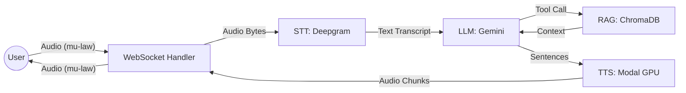
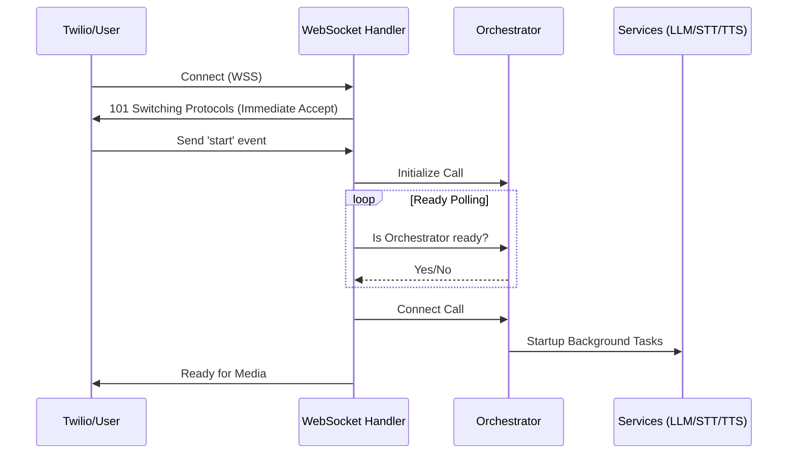
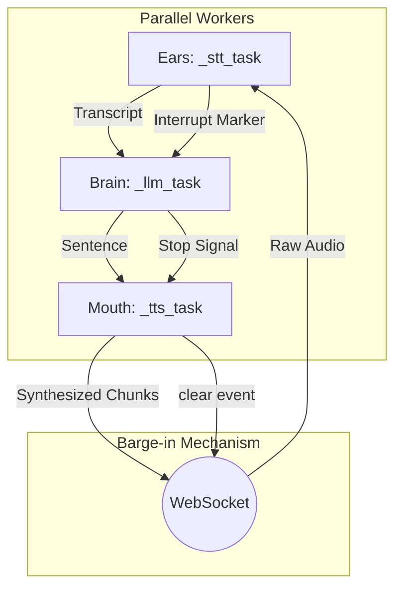

# System Architecture

Hermes AI is built on a distributed, asynchronous architecture designed to minimize the delay between a user finishing their sentence and the AI starting its response.

## 1. High-Level Flow Diagram

The following diagram illustrates the unidirectional flow of data through the Hermes pipeline:

## 2. Connection Handshake Logic

This diagram shows the non-blocking initialization sequence that prevents handshake timeouts:

## 3. Real-Time Conversation Pipeline

The parallel processing logic used to achieve low latency:

## 4. The Call Lifecycle

### **The Manager: CallOrchestrator**
The `CallOrchestrator` acts as the global control tower. Its primary responsibilities are:
*   **Registry:** Maintaining a mapping of all active `Call` objects.
*   **Service Delivery:** Injecting required services (LLM, TTS, STT) into new calls.
*   **Fleet Teardown:** Ensuring all sessions are gracefully closed during server shutdown.

### **The Pilot: Call Pipeline**
Every phone call is managed by an individual `Call` instance. This object runs three parallel background tasks:
1.  **STT Task (The Ears):** Consumes raw mu-law audio from the WebSocket and streams it to Deepgram.
2.  **LLM Task (The Brain):** Consumes transcripts from STT, triggers RAG tools, and streams sentences.
3.  **TTS Task (The Mouth):** Consumes sentences from LLM and streams synthesized audio back to the user.

## 5. Low-Latency Strategies

### **Zero-Latency Greetings**
To provide instant feedback, the system bypasses the LLM for the initial greeting. 
*   Handshake starts → Greeting is enqueued directly into the **TTS Task**.
*   The user hears "Hello" while the LLM and RAG are still initializing in the background.

### **Agentic RAG & Filler Speech**
When the AI needs to look up information:
1.  Gemini triggers a `function_call`.
2.  The service yields a **FillerMarker** (e.g., "One moment, let me check that...").
3.  The **TTS Task** speaks the filler while the **RAG Service** queries ChromaDB.
4.  Once data is retrieved, Gemini generates the final answer.

### **Barge-In (Interruption) Logic**
Conversation flow is maintained through a high-speed interrupt mechanism:
*   **Ears** detect speech → **InterruptMarker** is emitted.
*   **Pipeline** receives marker → Immediately clears the **TTS buffer** and sends a `clear` event to Twilio.
*   The AI stops talking the instant the user starts.

## 6. Technology Stack

*   **Runtime:** Python 3.11 (Asyncio).
*   **API:** FastAPI (Asynchronous lifespan management).
*   **LLM:** Google Gemini 2.5 Flash.
*   **STT:** Deepgram Nova-2 (Streaming mode).
*   **TTS:** Custom Chatterbox model on Modal serverless GPUs.
*   **Vector DB:** ChromaDB (Serverless).

---
**Status:** Architecture Hardened
