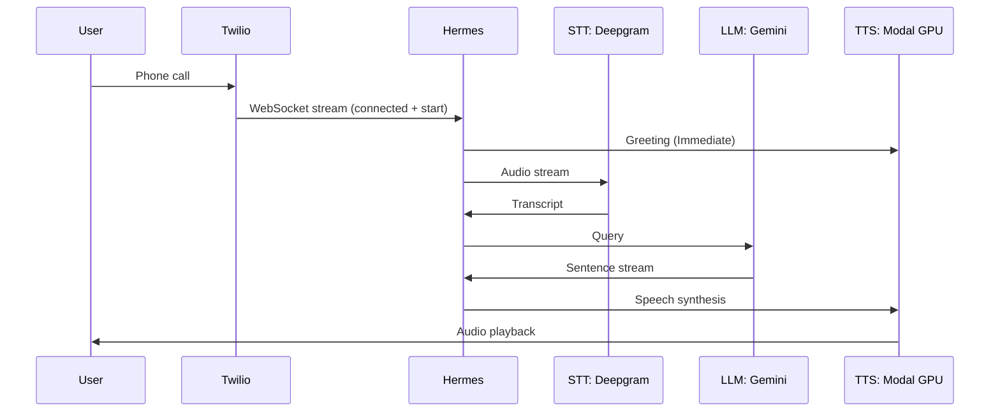
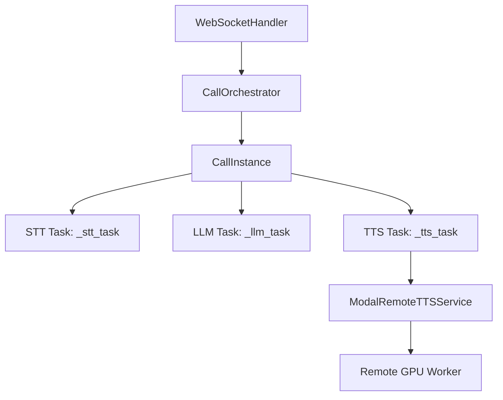
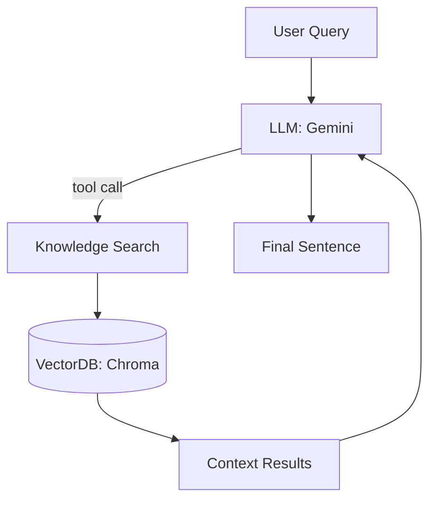

# System Architecture

Hermes AI is built on a distributed, asynchronous architecture designed to minimize the delay between a user finishing their sentence and the AI starting its response.

## 1. Voice System Flow

This sequence diagram illustrates the end-to-end lifecycle of a voice interaction:



## 2. Internal Component Architecture

The internal design optimized for high-concurrency and asynchronous task management:



### **Core Components**

#### **CallOrchestrator**
Responsible for:
*   **Fleet Management:** Managing the lifecycle of all active calls.
*   **Routing:** Directing interrupts and DTMF signals to the correct session.
*   **Safety:** Ensuring clean teardown and preventing resource leaks.

#### **Call (CallInstance)**
Responsible for:
*   **STT Pipeline:** Real-time transcription and voice activity detection.
*   **LLM Reasoning:** Context assembly, Agentic RAG triggering, and response generation.
*   **TTS Generation:** Coordinating with the remote GPU for audio synthesis.
*   **State Machine:** Managing the precise state (`LISTENING`, `SPEAKING`, etc.) of a single session.

## 3. Agentic Retrieval System (RAG)

Hermes uses an "Agentic" approach where the LLM decides when to search the knowledge base:



## 4. The Streaming Pipeline

Latency is minimized by streaming data through every stage of the relay race:

```text
Audio Input (8kHz mu-law)
↓
STT streaming (Real-time transcription)
↓
Transcript (Buffered sentences)
↓
LLM reasoning (Parallel tool execution)
↓
Sentence streaming (Immediate TTS handoff)
↓
TTS synthesis (GPU-accelerated chunks)
↓
Audio output (8kHz mu-law returned to Twilio)
```

## 5. Low-Latency Strategies

### **Zero-Latency Greetings**
To provide instant feedback, the system bypasses the LLM for the initial greeting. 
*   Handshake starts → Greeting is enqueued directly into the **TTS Task**.
*   The user hears "Hello" while the LLM and RAG are still initializing in the background.

### **Barge-In (Interruption) Logic**
Conversation flow is maintained through a high-speed interrupt mechanism:
*   **Ears** detect speech → **InterruptMarker** is emitted.
*   **Pipeline** receives marker → Immediately clears the **TTS buffer** and sends a `clear` event to Twilio.
*   The AI stops talking the instant the user starts.

