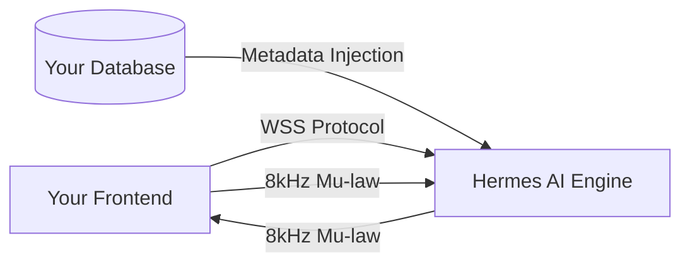
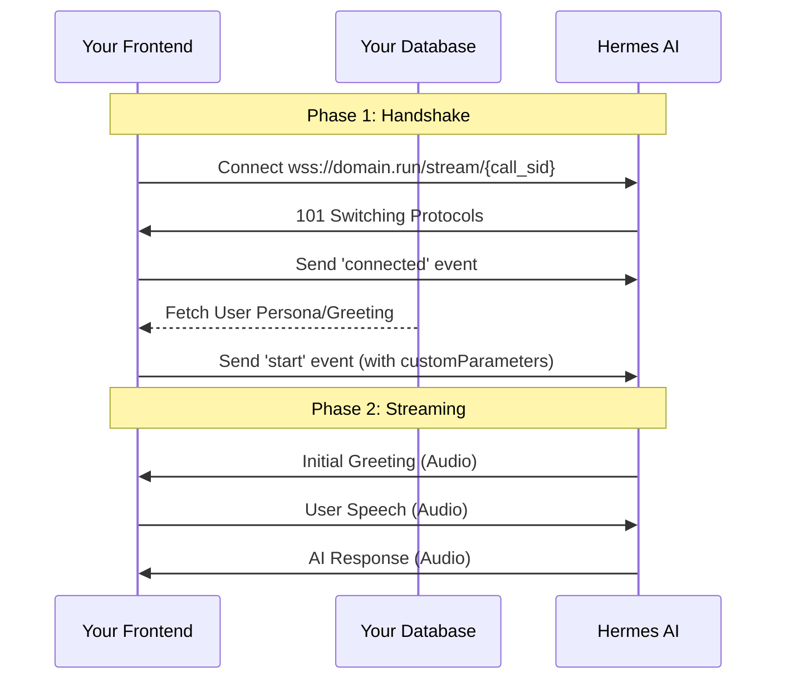

# Developer Integration Guide

This guide details how to integrate your frontend and database with the Hermes AI WebSocket streaming engine.

## 1. High-Level Architecture



## 2. Connection Lifecycle

The following sequence diagram shows the non-blocking handshake required to start a session:



## 3. The 'start' Event (Dynamic Parameters)

The `start` event is where you bridge your database data into the AI session. All fields inside `customParameters` are dynamic.

### **Handshake Payload**
```json
{
  "event": "start",
  "start": {
    "callSid": "unique_session_id",
    "customParameters": {
      "persona": "technical_support",
      "greeting": "Hello, welcome back! I see you had a ticket yesterday.",
      "max_history": "10",
      "test_prompt": "Help me with my internet connection"
    }
  }
}
```

### **Parameter Reference**
| Key | Type | Purpose |
| :--- | :--- | :--- |
| `persona` | String | Sets the AI tone (from `hermes/prompts/system/`). |
| `greeting` | String | Overrides the default greeting (perfect for DB-driven personalization). |
| `max_history` | Number | Limits conversation memory to save LLM tokens. |
| `test_prompt` | String | Injects an initial user thought to trigger an immediate LLM turn. |

## 4. Media Streaming Pipeline

Hermes uses a low-latency parallel pipeline. Audio must be handled as follows:

### **Streaming Specs**
*   **Protocol:** WebSocket Binary or JSON.
*   **Format:** 8kHz Mu-law (G.711 PCMU).
*   **Direction:** Bidirectional (Full Duplex).

```text
Input: [User Mic] -> [8kHz Resample] -> [Mu-law Encode] -> [Base64] -> [WebSocket]
Output: [WebSocket] -> [Base64 Decode] -> [Mu-law Decode] -> [8kHz Resample] -> [User Speaker]
```

## 5. JavaScript Implementation Example

```javascript
const socket = new WebSocket('wss://your-hermes-api.modal.run/stream/my_unique_id');

socket.onopen = () => {
  // Send the handshake
  socket.send(JSON.stringify({
    event: 'start',
    start: {
      callSid: 'my_unique_id',
      customParameters: {
        greeting: "Welcome to our live dashboard integration!"
      }
    }
  }));
};

socket.onmessage = (msg) => {
  const data = JSON.parse(msg.data);
  if (data.event === 'media') {
    const audioPayload = data.media.payload; // Base64 Mu-law string
    playAudioChunk(audioPayload);
  }
};
```

---
**Status:** Integration Verified
