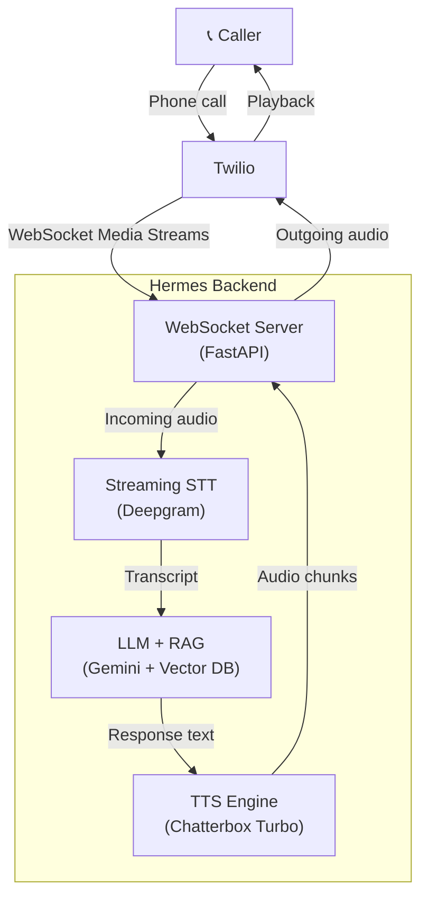

# Hermes Architecture

This document describes the architecture of the Hermes Voice Support Service.

## Overview

Hermes is a real-time voice AI service that processes phone calls through a pipeline of Speech-to-Text (STT), Large Language Model (LLM), and Text-to-Speech (TTS) services. It uses Twilio for telephony integration and FastAPI for the web server.

## System Architecture



## Component Overview

### 1. WebSocket Handler (`hermes/websocket/`)

The WebSocket handler manages connections from Twilio's media streams:

- **ConnectionManager**: Manages active WebSocket connections keyed by call SID
- **Handler**: Processes incoming Twilio messages (connected, start, media, dtmf, stop)
- **Schemas**: Pydantic models for Twilio message validation

**Key Points:**
- Audio is received as 8kHz mu-law encoded chunks
- Outgoing audio must be 8kHz mu-law encoded
- DTMF events are used for user interaction (transfer, repeat, hangup)

### 2. Call State Machine (`hermes/core/call.py`)

Each call is managed by a `Call` class that coordinates:

- **Queues**: Audio input, text output, audio output
- **Tasks**: Async tasks for STT, LLM, and TTS processing
- **State**: IDLE → CONNECTING → LISTENING → PROCESSING → SPEAKING
- **History**: Conversation turn tracking for context

**Pipeline Flow:**
```
Audio In (8kHz mu-law)
    ↓
[Audio Queue] → STT Task → [Text Queue]
                                ↓
                        LLM Task + RAG
                                ↓
                    [Audio Queue] → TTS Task
                                        ↓
                                Audio Out (8kHz mu-law)
```

### 3. Services (`hermes/services/`)

#### STT Service (`stt.py`)
- Provider: Deepgram Nova-2
- Input: PCM audio (16kHz recommended)
- Output: Transcribed text
- Features: Punctuation, formatting, language detection

#### LLM Service (`llm.py`)
- Provider: Google Gemini
- Streaming: Yes (token-by-token)
- Context: Conversation history + RAG results
- System prompt tuned for voice interaction

#### TTS Service (`tts.py`)
- Primary: Chatterbox Turbo
- Fallback: OpenAI TTS
- Output: PCM audio (16kHz)
- Post-processing: Downsample to 8kHz, mu-law encode

#### RAG Service (`rag.py`)
- Retrieves relevant documents from vector database
- Adds context to LLM prompts
- Configurable similarity threshold and top-K

#### Vector DB (`vector_db.py`)
- Providers: ChromaDB (default) or Pinecone
- Embeddings: sentence-transformers/all-MiniLM-L6-v2
- Supports document chunking and metadata

### 4. Audio Processing (`hermes/core/audio.py`)

Core utilities:
- **Mu-law codec**: Encode/decode for Twilio
- **Resampling**: Between 8kHz and 16kHz
- **Format conversion**: Float ↔ Int16
- **Gain/normalization**: Audio leveling

### 5. Workers (`hermes/workers/`)

Background processing:
- **TTS Worker**: Dedicated worker for TTS generation
  - Decouples TTS from main WebSocket task
  - Allows TTS pooling and batching
  - Redis-backed job queue

- **Scheduler**: Periodic tasks
  - Metrics collection
  - Database cleanup
  - Health checks

### 6. Monitoring (`hermes/api/metrics.py`)

Prometheus metrics:
- Active calls gauge
- Latency histograms (STT, LLM, TTS)
- Error counters
- Token usage
- WebSocket connection count

## Data Flow

### Incoming Call

1. Twilio forwards call to Hermes WebSocket endpoint
2. WebSocket handler accepts connection
3. `ConnectionManager` creates `Call` instance
4. Call starts background tasks (STT, LLM, TTS)
5. Call enters LISTENING state

### Audio Processing Loop

1. **Inbound Audio**:
   - Twilio sends mu-law audio chunks
   - Decode to PCM, queue for STT
   - STT task accumulates audio, detects speech
   - On speech detection, transcribe and queue text

2. **LLM Processing**:
   - LLM task receives transcribed text
   - Retrieve relevant documents (RAG)
   - Generate response with context
   - Stream tokens, queue complete response for TTS

3. **Outbound Audio**:
   - TTS task receives text response
   - Generate audio, encode to mu-law
   - Send back to Twilio
   - Call returns to LISTENING state

### Call End

1. Twilio sends stop event or disconnect
2. WebSocket handler signals call to stop
3. Call cancels background tasks
4. Cleanup resources, log metrics
5. Optionally save conversation to database

## Deployment Architecture

### Docker Compose (Local Development)

```yaml
services:
  app: FastAPI application
  tts-worker: Background TTS worker
  db: PostgreSQL for call logs
  redis: Caching and job queue
  chromadb: Vector database
```

### Kubernetes (Production)

```
┌────────────────────────────────────────────────────────────┐
│                      Kubernetes Cluster                   │
│  ┌─────────────┐  ┌─────────────┐  ┌─────────────┐       │
│  │   App Pod   │  │  App Pod    │  │  App Pod    │       │
│  │  (3 replicas)│  │             │  │             │       │
│  └──────┬──────┘  └──────┬──────┘  └──────┬──────┘       │
│         │                │                │              │
│         └────────────────┴────────────────┘              │
│                          │                                 │
│                   ┌──────┴──────┐                          │
│                   │   Ingress    │                          │
│                   │  (WebSocket)  │                          │
│                   └─────────────┘                          │
│                                                             │
│  ┌─────────────┐  ┌─────────────┐  ┌─────────────┐       │
│  │    Redis    │  │ PostgreSQL  │  │  ChromaDB   │       │
│  │   (Cluster) │  │  (Primary)  │  │             │       │
│  └─────────────┘  └─────────────┘  └─────────────┘       │
│                                                             │
└────────────────────────────────────────────────────────────┘
```

### Scaling Considerations

- **Horizontal**: Scale app pods based on active calls
- **Vertical**: Increase resources for TTS worker
- **Queue-based**: Scale TTS workers based on queue depth
- **WebSocket**: Use sticky sessions for WebSocket connections

## Security

### Authentication

- Twilio request validation (signature checking)
- API key-based service authentication

### Data Protection

- Encrypted in transit (TLS)
- Encrypted at rest (database encryption)
- PII handling per compliance requirements

### Network Security

- Private subnets for databases
- VPC peering for external services
- Rate limiting on endpoints

## Performance Optimization

### Latency Budget

| Component | Target | Notes |
|-----------|--------|-------|
| STT | <500ms | Streaming, real-time |
| LLM (TTFT) | <1s | Time to first token |
| LLM (Total) | <3s | Full response generation |
| TTS | <500ms | First audio chunk |
| **Total** | **<5s** | End-to-end response |

### Optimization Strategies

1. **Streaming**: All services support streaming
2. **Pre-warming**: Keep connections warm
3. **Caching**: Redis for frequent queries
4. **Connection Pooling**: Reuse HTTP connections
5. **Async**: All I/O is async

## Error Handling

### Retry Strategy

- STT: 3 retries with exponential backoff
- LLM: 3 retries with exponential backoff
- TTS: 3 retries with exponential backoff
- Vector DB: 5 retries with exponential backoff

### Fallbacks

- STT: Deepgram only (single provider)
- LLM: Gemini with fallback to OpenAI
- TTS: Chatterbox → OpenAI → ElevenLabs

### Circuit Breaker Pattern

Services implement circuit breaker to prevent cascade failures:
- Open: Fail fast
- Half-open: Test recovery
- Closed: Normal operation

## Development

### Local Setup

```bash
# Install dependencies
poetry install --extras all

# Run services
docker-compose up -d redis chromadb

# Run app
poetry run uvicorn hermes.main:app --reload

# Run tests
poetry run pytest
```

### Testing Strategy

- **Unit tests**: Core logic, audio processing
- **Integration tests**: Service integrations with mocks
- **E2E tests**: Full WebSocket flow
- **Load tests**: Benchmark TTS latency

## Future Considerations

### Scalability

- WebSocket load balancing
- Multi-region deployment
- Model quantization for edge deployment

### Features

- Multi-language support
- Voice cloning
- Call analytics dashboard
- A/B testing for prompts
- Conversation summarization

### Tech Debt

- Implement proper database models with SQLAlchemy
- Add comprehensive test coverage
- Performance profiling and optimization
- Documentation for operators
